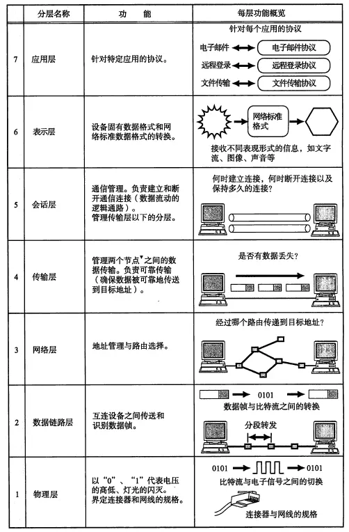

# OSI，TCP/IP，五层协议的体系结构，以及各层协议

**OSI分层      （7层）**：物理层、数据链路层、网络层、传输层、会话层、表示层、应用层。

**TCP/IP分层（4层）**：网络接口层、                网际层、传输层、                              应用层。

**五层协议     （5层）**：物理层、数据链路层、网络层、传输层、                              应用层。

# OSI参考模型中各个分层的作用

# IP地址的分类

- A类地址

  **以0开头**，      第一个字节范围：0~127（1.0.0.0 - 126.255.255.255）；

  私有地址：10.0.0.0 ~ 10.255.255.255

- B类地址

  **以10开头**，    第一个字节范围：128~191（128.0.0.0 - 191.255.255.255）；

  私有地址：172.16.0.0—172.31.255.255

- C类地址

  **以110开头**，  第一个字节范围：192~223（192.0.0.0 - 223.255.255.255）；

  私有地址： 192.168.0.0—192.168.255.255

**IP地址与子网掩码相与得到主机号**

> 一个网络号192.168.5.0/24，子网掩码是255.255.255.248，可以构建的最大子网数和每个子网最多可容纳多少台机器？
>
> 192.168.5.0/24，前24位是网络号，后8位是主机号
>
> 子网掩码是255.255.255.248，即255.255.255.0b11111000，相当于主机号又被分成两部分, 前5位是子网号, 后3位是主机号。
>
> 所以，最大子网个数是 2^5, 主机个数为 2^3. 另外，**主机号全 0 代表本地主机, 全 1 表示广播**，所以每个子网最多容纳8 - 2 = 6台机器。

# 协议

**每一层的协议如下：**

物理层：   RJ45、CLOCK、IEEE802.3    （中继器，集线器，网关）

数据链路：PPP、FR、HDLC、VLAN、MAC  （网桥，交换机）

网络层：    IP、ICMP、ARP、RARP、OSPF、IPX、RIP、IGRP、 （路由器）

传输层：   TCP、UDP、SPX

会话层：   NFS、SQL、NETBIOS、RPC

表示层：   JPEG、MPEG、ASII

应用层：   FTP、DNS、Telnet、SMTP、HTTP、WWW、NFS

| TCP协议 | 端口 | 作用                                                         |
| ------- | ---- | ------------------------------------------------------------ |
| FTP     | 21   | 定义了文件传输协议                                           |
| SSH     | 22   | 专为远程登录会话和其他网络服务提供安全性的协议               |
| Telnet  | 23   | 一种用于远程登陆的协议，用户可以以自己的身份远程连接到计算机上，可提供基于DOS模式下的通信服务 |
| SMTP    | 25   | 邮件传送协议，用于发送邮件                                   |
| POP3    | 110  | 和SMTP对应，POP3用于接收邮件                                 |
| HTTP    | 80   | Web服务器传输超文本到本地浏览器的传送协议                    |
| HTTPS   | 443  | HTTP的加密版本                                               |

| UDP协议 | 端口 | 作用                                                         |
| ------- | ---- | ------------------------------------------------------------ |
| DNS     | 53   | 用于域名解析服务，将域名地址转换为IP地址                     |
| SNMP    | 161  | 简单网络管理协议，用来管理网络设备。由于网络设备很多，无连接的服务就体现出其优势 |
| TFTP    | 21   | 简单文件传输协议                                             |

## TCP

### 协议内容

+ 源端口和目的端口

  各占2字节，分别写入源端口号和目的端口号

+ 序列号seq

  4字节，发送数据包中的第一个字节的序列号。

  TCP为面向字节流的，在TCP传送的数据流中，每一个字节都有一个序号。

+ 确认号ack

  4字节，期望收到对方下次发送的数据的第一个字节的序号。

  若确认号为N，说明1 - N-1全部接受完毕

+ 首部长度(数据偏移)

  4比特，表示数据开始的地方离TCP段的起始处有多远。

  实际上就是TCP段首部的长度。由于首部长度不固定，因此数据偏移字段是必要的。

+ 控制位(标志位)

  一共6个，占6比特，设置为1时有效。按顺序依次为：URG、ACK、PSH、RST、SYN、FIN。

  | 标志位 |                                                              |
  | ------ | ------------------------------------------------------------ |
  | URG    | 紧急位，为1时，首部中的紧急指针有效                          |
  | ACK    | 确认位，为1时，首部中的确认号ack有效，<规定:建立连接后所有的传输报文段都要把ACK置为1> |
  | PSH    | 推送位，为1时， 接收方应该尽快将这个报文交给应用层           |
  | RST    | 复位标志，为1时， 重置连接                                   |
  | SYN    | 同步位，在建立连接时使用，当SYN=1而ACK=0时，表明这是一个连接请求报文段。对方若同意建立连接，在发回的报文段中使SYN=1和ACK=1 |
  | FIN    | 结束位，为1时，释放连接                                      |

+ 窗口

  占2字节，表示报文段发送方期望接收的字节数

+ 校验和

  校验和包含了伪首部、TCP首部和数据，校验和是TCP强制要求的，由发送方计算，接收方验证。

+ 紧急指针

  URG标志为1时，紧急指针有效，表示数据需要优先处理。紧急指针指出在TCP段中的紧急数据的最后一个字节的序号，使接收方可以知道紧急数据共有多长。

### 三次握手

**建立TCP连接时，需要客户端和服务端总共发送3个包以确认连接的建立**

1. 第一次握手

   client将同步位SYN置为1，选择一个初始序号seq = x，并将该报文发送给server，**client进入SYN_SEND状态**；

   (TCP规定：SYN = 1的报文段不能携带数据，而且要消耗掉一个序号)

2. 第二次握手

   server收到数据包后由标志位SYN=1知道client请求建立连接，server将标志位SYN和ACK都置为1，ack (number )=x+1，选择一个初始序号seq = y，并将该报文发送给client以确认连接请求，**server进入SYN_RCVD状态**；

3. 第三次握手

   client收到确认后，检查ack是否为x+1，ACK是否为1，如果正确，则将标志位ACK置为1，ack=y+1，并将该报文发送给server，server检查ack是否为y+1，ACK是否为1，如果正确，则连接建立成功，**client和server进入ESTABLISHED状态**，完成三次握手，随后client与server之间可以开始传输数据了。

### 四次挥手

断开TCP连接时，需要客户端和服务端发送4个包以确认连接的断开。在socket编程中，这一过程可由客户端或服务端任何一方来触发。

TCP连接是全双工的，因此，每个方向都必须要单独进行关闭。

1. 第一次挥手

   将FIN置为1，序号seq = u，它等于前面已传送过的数据的最后一个字节的序号加1，**client进入FIN_WAIT_1状态；**

   (TCP规定：FIN不携带数据，但是消耗一个序列号)

2. 第二次挥手

   server收到连接释放报文段后即发出确认，确认号ack =u + 1，序号seq = v，**server进入CLOSE_WAIT状态**，

   **client收到server的确认后，进入FIN_WAIT_2状态，**此时client→server方向的连接就释放了。

3. 第三次挥手

   server已经没有数据要向client发送了，server发送连接释放报文段，关闭server→client的数据传送，此时**server进入LAST_ACK状态**；

4. 第四次挥手

   client收到连接释放报文后，对此发出确认，进入TIME_WAIT状态，等待2MSL后关闭连接。

### 三握四挥Problem

1. **为什么要使用三次握手**

   为了防止已失效的连接请求报文段突然又传送到了服务端，因而产生错误，主要目的防止server端一直等待，浪费资源。

   如果采用两次的话，会出现下面这种情况。

   解释1：比如是A机要连到B机，结果发送的连接信息由于某种原因没有到达B机；于是，A机又发了一次，结果这次B收到了，于是就发信息回来，两机就连接。传完东西后，断开。结果这时候，原先没有到达的连接信息突然又传到了B机，于是B机发信息给A，然后B机就以为和A连上了，这个时候B机就在等待A传东西过去。

   解释2：client发出的第一个连接请求报文段并没有丢失，而是在某个网络结点长时间的滞留了，以致延误到连接释放以后的某个时间才到达server。本来这是一个早已失效的报文段。但server收到此失效的连接请求报文段后，就误认为是client再次发出的一个新的连接请求。于是就向client发出确认报文段，同意建立连接。假设不采用“三次握手”，那么只要server发出确认，新的连接就建立了。由于现在client并没有发出建立连接的请求，因此不会理睬server的确认，也不会向server发送数据。但server却以为新的运输连接已经建立，并一直等待client发来数据。这样，server的很多资源就白白浪费掉了。采用“三次握手”的办法可以防止上述现象发生。例如刚才那种情况，client不会向server的确认发出确认。server由于收不到确认，就知道client并没有要求建立连接。

2. **SYN攻击**

   在三次握手过程中，server发送SYN_ACK报文之后，收到client的ACK之前的连接为半连接（half-open connect），此时server处于SYN_RCVD状态，当收到ACK后，server转入ESTABLISHED状态。

   SYN攻击就是client在短时间内伪造大量不存在的IP地址，并向server不断地发送SYN包，server回复确认包，并等待client的确认，由于源地址是不存在的，因此，server需要不断重发直至超时，这些伪造的SYN包将长时间占用未连接队列，导致正常的SYN请求因为队列满而被丢弃，从而引起网络堵塞甚至系统瘫痪。SYN攻击时一种典型的DDOS攻击。

3. 为什么使用四次挥手

   因为TCP是全双工模式

4. 释放连接时，为什么在TIME_WAIT状态下等待2MSL?

   保证最后一个ACK报文段能到达服务端；

   (MSL，Maximum Segment Life，这是TCP 对TCP Segment 生存时间的限制)

### TCP的滑动窗口，流量控制和拥塞控制

https://juejin.im/post/5b0b7496f265da0dd013a79b

https://juejin.im/post/5a9659fa5188257a5e57784c

TCP协议作为一个可靠的，面向字节流的传输协议，其可靠性和流量控制由滑动窗口协议保证，而拥塞控制则由拥塞窗口结合一系列的控制算法实现。

- 滑动窗口协议

  1. “窗口”对应的是一段可以被发送者发送的字节序列，其连续的范围称之为“窗口”；

  2. “滑动”则是指这段“允许发送的范围”是可以随着发送的过程而变化的，方式就是按顺序“滑动”。

     

- 流量控制

  **接收方**传递信息给**发送方**，使其不要发送数据太快，是一种端到端的控制。

  主要方式就是返回的报文中会包含接收窗口大小，利用窗口大小来控制发送方的数据发送大小。

  发送方的发送窗口应该小于等于拥塞窗口

- 拥塞控制

  拥塞控制就是防止过多的数据注入到网络中，这样可以使网络中的路由器或链路不致过载。

  常用控制方法：慢开始、拥塞控制、快重传、快恢复

  

- 超时重传

  TCP协议保证数据可靠性的重要机制，在发送某一个数据以后就开启一个计时器，在一定时间内如果没有得到发送的数据报的ACK报文，那么就重新发送数据，直到发送成功为止。

## TCP UDP区别

+ TCP(TCP报文段)

  面向连接的运输层协议    

  一对一（点对点）  

  可靠交付  

  全双工通信    

  面向字节流

+ UDP(UDP用户数据报)

  (报头包括: 源端口号 目的端口号数据报长度 检验和)

  无连接   

  支持 一对一、多对一、一对多的交互通信

  尽最大努力交付（即不可靠交付 主机不需要维持复杂的链接状态）

  面向数据报

  没有拥塞控制  

  首部开销小（仅有八个字节）

+ TCP和UDP的区别

  TCP提供面向连接的、可靠的数据流传输，而UDP提供的是非面向连接的、不可靠的数据流传输。

  TCP传输单位称为TCP报文段，UDP传输单位称为用户数据报。

  TCP注重数据安全性，UDP数据传输快。

## ARP

地址解析协议：IP->物理地址

APP协议的基本功能就是通过目标设备的IP地址，查询目标设备的MAC地址。

1. 首先，每个主机都会在自己的ARP缓冲区中建立一个ARP列表，以表示IP地址和MAC地址之间的对应关系。
2. 当源主机要发送数据时，首先检查ARP列表中是否有对应IP地址的目的主机的MAC地址，如果有，则直接发送数据，如果没有，就向本网段的所有主机发送ARP数据包，该数据包包括的内容有：源主机IP地址，源主机MAC地址，目的主机的IP地址。
3. 当本网络的所有主机收到该ARP数据包时，首先检查数据包中的IP地址是否是自己的IP地址，如果不是，则忽略该数据包，如果是，则首先从数据包中取出源主机的IP和MAC地址写入到ARP列表中，如果已经存在，则覆盖，然后将自己的MAC地址写入ARP响应包中，告诉源主机自己是它想要找的MAC地址。
4. 源主机收到ARP响应包后。将目的主机的IP和MAC地址写入ARP列表，并利用此信息发送数据。如果源主机一直没有收到ARP响应数据包，表示ARP查询失败。

**广播发送ARP请求，单播发送ARP响应。**

## RARP

逆地址解析协议，物理地址->IP

# [彻底理解浏览器的缓存机制](https://heyingye.github.io/2018/04/16/%E5%BD%BB%E5%BA%95%E7%90%86%E8%A7%A3%E6%B5%8F%E8%A7%88%E5%99%A8%E7%9A%84%E7%BC%93%E5%AD%98%E6%9C%BA%E5%88%B6/)

浏览器的缓存机制也就是HTTP缓存机制，其机制是根据HTTP报文的缓存标识进行的。

# URL请求过程

https://juejin.im/post/5b83b0bfe51d4538c63131a8

https://juejin.im/entry/58ce00c5ac502e00589b4bde

如点击www.baidu.com

简易版：

1. 浏览器缓存
2. DNS域名解析，查询顺序如下
   - 浏览器缓存，如chrome浏览器`chrome://net-internals/#sockets`
   - 系统缓存
   - hosts
   - 向DNS服务器查询域名对应的IP
3. TCP连接
   - 三次握手
   - 数据传输
   - 四次挥手
4. HTTP请求与响应

# 负载均衡

https://www.cnblogs.com/danbing/p/7459224.html

https://zhuanlan.zhihu.com/p/32841479

https://www.cnblogs.com/itfly8/p/5043435.html

https://www.cnblogs.com/itfly8/p/5043452.html

# 常见简称

| WAN                                       | Wide Area Network，广域网                                    |
| ----------------------------------------- | ------------------------------------------------------------ |
| LAN                                       | Local Area Network，局域网                                   |
| VLAN                                      | Virtual LAN，虚拟局域网                                      |
| WLAN                                      | Wireless LAN，无线局域网                                     |
| TTS                                       | Time Sharing System，分时系统                                |
| WWW                                       | World Wide Web，万维网                                       |
| IP                                        | Internet Protocol，互联网协议                                |
| CPU                                       | Central Processing Unit，中央处理器                          |
| OS                                        | Operating System，操作系统                                   |
| ISO                                       | International Organization for Standards，国际标准化组织     |
| OSI                                       | Open Systems Interconnection，开放式通信系统互联参考模型     |
| ISP                                       | Internet Service Provider，互联网接入供应商                  |
| IETF                                      | The Internet Engineering Task Force，国际互联网工程任务组，TCP/IP协议制定者 |
| IESG                                      | IETF的主要成员                                               |
| RFC                                       | Request For Comment，征求协议相关意见的文档                  |
| NOC                                       | Network Operation Center，网络操作中心                       |
| NIC                                       | Network Interface Card，网络适配器，网卡                     |
| IX                                        | Internet Exchange，网络交换中心                              |
| FCS                                       | Frame Check Sequence，帧校验序列                             |
| PPP                                       | Point to Point Protocol，点对点协议                          |
| FDDI                                      | Fiber Distributed Data Interface，光纤分布式数据接口         |
| ATM                                       | Asynchronous Transfer Mode，异步传输模式                     |
| [ICMP](https://baike.baidu.com/item/ICMP) | Internet Control Message Protocol，Internet控制报文协议      |
|                                           |                                                              |
|                                           |                                                              |
|                                           |                                                              |
|                                           |                                                              |
|                                           |                                                              |
|                                           |                                                              |
|                                           |                                                              |
|                                           |                                                              |
|                                           |                                                              |